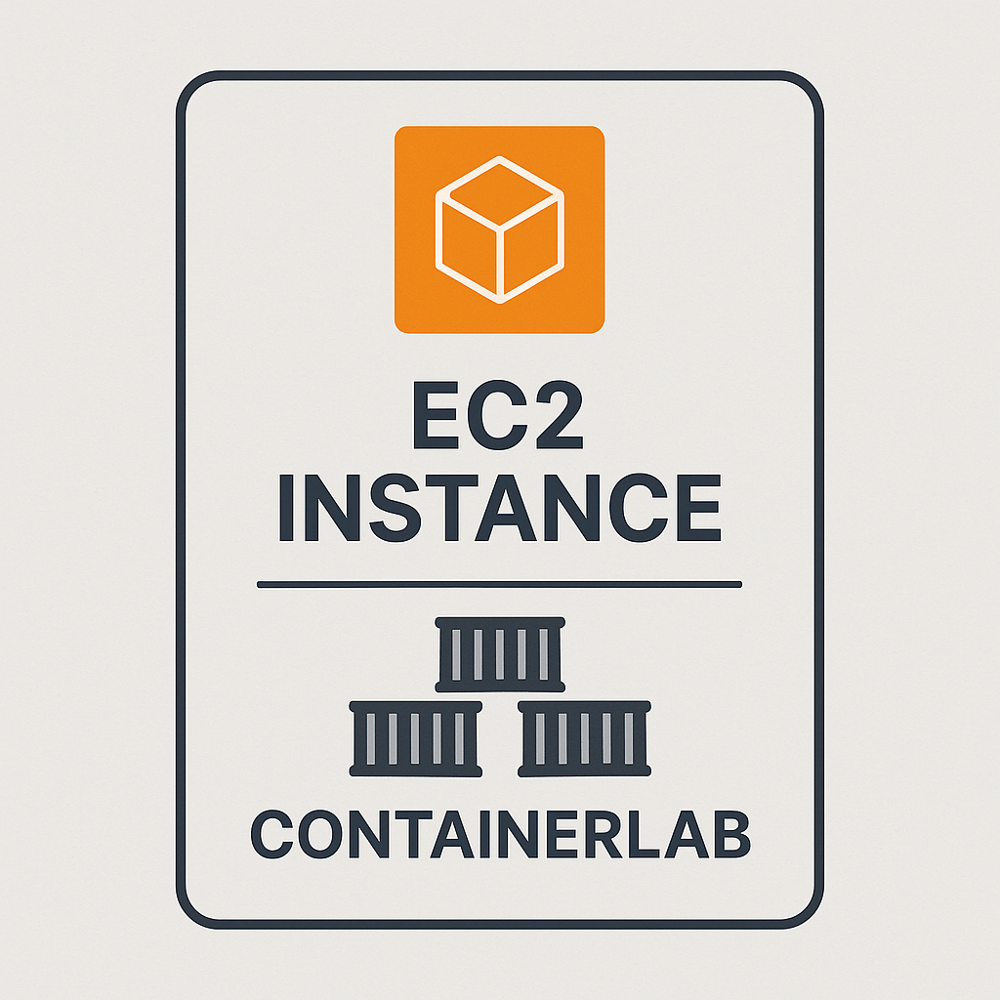

# Kubernetes Networking with Calico and ContainerLab

🎯 **Learn Kubernetes networking hands-on!** This repository provides a complete toolkit for deploying and experimenting with **Calico CNI**, **ContainerLab topologies**, and **Kubernetes networking concepts** on AWS infrastructure.

Perfect for:
- 🔬 **Network engineers** exploring Kubernetes networking
- 📚 **Students** learning CNI implementations and BGP routing
- 🛠️ **DevOps practitioners** understanding pod-to-pod communication
- 🌐 **Security professionals** studying network policies and micro-segmentation

## Prerequisites

- AWS CLI configured with appropriate permissions
- Terraform (1.0+)
- Ansible (2.9+)
- SSH key pair in `~/.ssh/id_rsa` (public key in `~/.ssh/id_rsa.pub`)

## Getting Started

### Deploying the Lab Environment

1. Clone this repository:
   ```
   git clone https://github.com/aadhilam/k8-networking-calico-containerlab.git
   cd container-labs
   ```

2. Run the deployment script:
   ```
   chmod +x deploy.sh
   ./deploy.sh
   ```

The deployment script will:
- Provision a t3.2xlarge EC2 instance in us-east-1 using Terraform
- Configure the instance with Docker, ContainerLab, Kind, and kubectl using Ansible
- Copy lab files to the instance
- Establish an SSH session to the instance



### Working with the Lab

Once connected to the EC2 instance:
- ContainerLab is available for creating network topologies
- Kind is available for creating Kubernetes clusters
- Docker is configured and ready to use
- The ubuntu user has passwordless sudo access

#### Lessons
1. [Calico IP Address Management (IPAM) for Kubernetes](containerlab/calico-ipam/README.md)
2. [Calico Pod Networking with Veth Pairs and Routing](containerlab/pod-network/README.md)


## Infrastructure Details

- **Instance Type**: t3.2xlarge (8 vCPUs, 32GB RAM)
- **Storage**: 50GB GP3 SSD volume
- **Operating System**: Ubuntu 22.04 LTS
- **Pre-installed Tools**:
  - Docker
  - ContainerLab
  - Kind (Kubernetes in Docker)
  - kubectl
  - jq, curl, tcpdump, bridge-utils, iproute2

## Project Structure

```
container-labs/
├── ansible/
│   └── playbook.yml        # Ansible configuration for the instance
├── containerlab/           # ContainerLab topologies and configurations
├── images/                 # Documentation images
├── deploy.sh               # Main deployment script
├── destroy.sh              # Cleanup script
├── main.tf                 # Terraform infrastructure definition
├── variables.tf            # Terraform variable definitions
└── outputs.tf              # Terraform output definitions
```

## Cleanup

When you're done with the lab environment, you can clean everything up:

```
chmod +x deploy.sh
./destroy.sh
```

This script will:
- Destroy all Terraform-managed resources (EC2 instance)
- Remove local temporary files

## Notes

- The EC2 instance public IP is saved to `ec2_ip.txt` for easy reference
- The ubuntu user is configured with passwordless sudo and Docker group membership
- Docker environment variables and completions are automatically loaded in the shell

**Connection Requirements:**
- Your SSH private key should be in `~/.ssh/id_rsa`
- The security group allows SSH access (port 22) from your IP
- The instance will have a public IP address for direct access

**Troubleshooting Connection Issues:**
```bash
# If you get permission denied, ensure your key has correct permissions
chmod 600 ~/.ssh/id_rsa

# Test connection with verbose output
ssh -v ubuntu@$(cat ec2_ip.txt)

# Connect using specific key file
ssh -i ~/.ssh/id_rsa ubuntu@$(cat ec2_ip.txt)
```